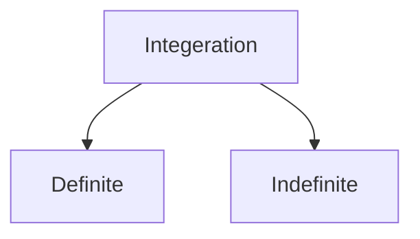

---
{"dg-publish":true,"permalink":"/notes/z-semester-1/mathematics/calculus/integeration/"}
---

$x=2y^{2}-4$  and $x=y^{2}$

- $\int^{a}_{-a} f(x)$
	- if $f(x)$ is odd = 0 
	- if $f(x)$ is even =  $\int^{a}_{0} f(x)$
>[!tldr]- Arc Length
> $L=\int_{a}^{b} \sqrt{ 1-f'(x)^{2} } \, dx$ 
> > [!NOTE]
> >  $L=\int_{a}^{b} 2\pi \ |f(x)|\sqrt{ 1-f'(x)^{2} } \, dx$ 

>[!tldr]- Volume of revolved objects
>- $\pi\int^{b}_{a}  \ f(x)^{2} \ dx$ 
> > [!NOTE]- Volume for washers
> >- washers have a hollow space, its when two curves are rotated around the axis.
> >-  $\pi\int^{b}_{a}  \ \{f(x)^{2} - g(x)^{2}\} \ dx$ 
> >- where $f(x)$ is outer ring and $g(x)$ is inner ring

- Subsitutions to make integeration easier
  $\sqrt{ a^{2}- x^{2} }\to \qquad x=a\sin\theta$
  $\sqrt{ x^{2}- a^{2} }\to \qquad x=a\sec\theta$
  $\sqrt{ a^{2}+ x^{2} }\to \qquad x=a\tan\theta$
>[!question]- $\int \dfrac{1}{x\sqrt{ 4-x^{2} }}dx$
>   $\sqrt{ 2^{2}- x^{2} }\to \qquad x=2\sin\theta$
>   $dx=2\cos\theta \to \qquad \int \dfrac{1}{2\sin\theta \times \sqrt{ 4-4\sin ^{2}\theta }}\times 2\cos \theta\ d\theta$
>   $\int \dfrac{1}{2\sin\theta \times \cancel{ 2\cos\theta }}\times \cancel{ 2\cos \theta }\ d\theta$
>   $\dfrac{1}{2}\int{ \cos ec \ \theta  }\ d\theta$

$\int \dfrac{dx}{2x^{2}+5x+7}\qquad\to 2x^{2}+5x+7=2(x^{2}+\dfrac{5}{2}x+\dfrac{7}{2})=\qquad$

  
